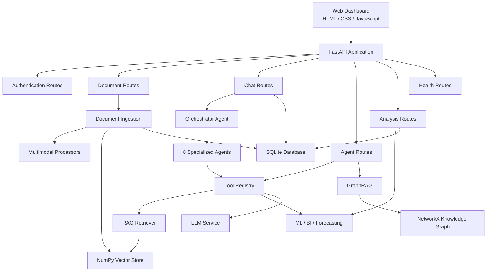
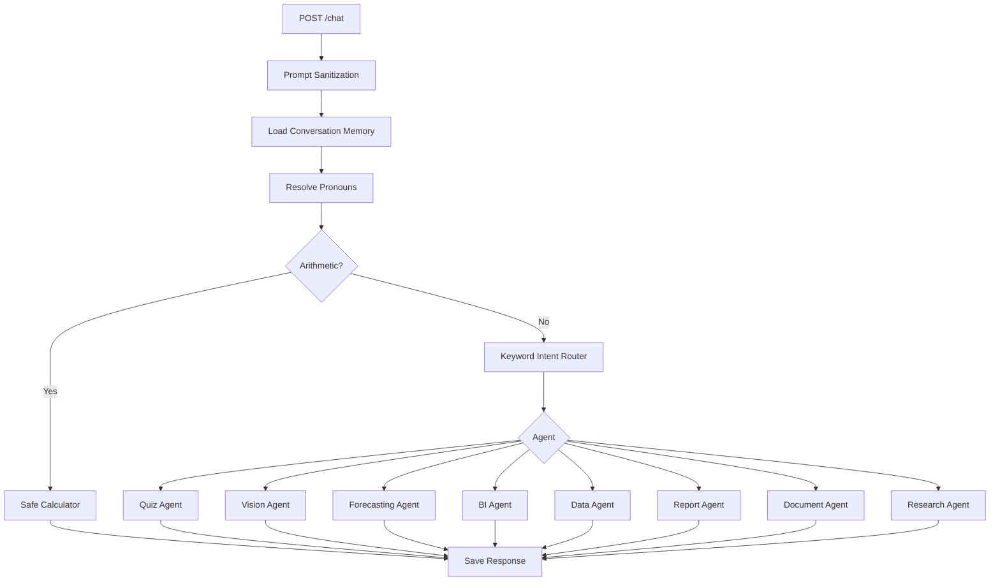
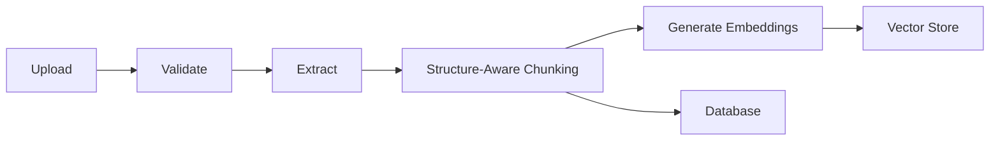
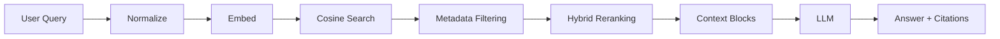
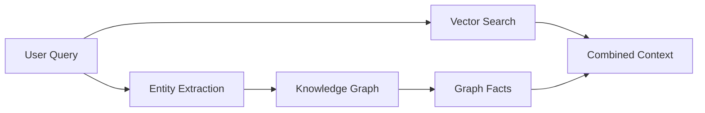
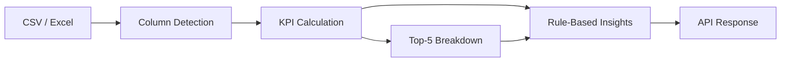

<div align="center">

# 🧠 MultiMind AI

### Multi-Agent Orchestration • Multimodal RAG • Business Intelligence • ML • Forecasting

<p>
  <strong>A FastAPI platform that routes natural-language requests to specialized agents for document Q&amp;A with citations, tabular analytics, KPI reporting, machine learning, time-series forecasting, report generation, quizzes, and image analysis — all through a built-in web dashboard.</strong>
</p>

<p>
  
</p>

<p>
  
  
  
  
  
  
  
  
  
  
  
  
  
  
</p>

<p>
  
</p>

<p>
  <strong>📄 Document Intelligence</strong> &nbsp;•&nbsp; <strong>🔍 RAG + Citations</strong> &nbsp;•&nbsp; <strong>🤖 Multi-Agent AI</strong> &nbsp;•&nbsp; <strong>📊 Business Intelligence</strong> &nbsp;•&nbsp; <strong>🧠 Machine Learning</strong> &nbsp;•&nbsp; <strong>📈 Forecasting</strong>
</p>

<p>
  
  
</p>

</div>

---

# 📋 Table of Contents

* [Overview](#overview)
* [Features](#features)
* [System Architecture](#system-architecture)
* [Multi-Agent Workflow](#multi-agent-workflow)
* [Document Intelligence & RAG](#document-intelligence--rag)
* [GraphRAG](#graphrag)
* [Business Intelligence](#business-intelligence)
* [Machine Learning](#machine-learning)
* [Forecasting](#forecasting)
* [Reports, Quizzes & Image Analysis](#reports-quizzes--image-analysis)
* [Web Dashboard](#web-dashboard)
* [Technology Stack](#technology-stack)
* [Project Structure](#project-structure)
* [Database](#database)
* [Authentication & Security](#authentication--security)
* [Configuration](#configuration)
* [Installation](#installation)
* [Running the Application](#running-the-application)
* [Docker](#docker)
* [API Reference](#api-reference)
* [Testing](#testing)
* [CI/CD](#cicd)
* [Troubleshooting](#troubleshooting)
* [Limitations](#limitations)
* [Roadmap](#roadmap)
* [Project Status](#project-status)
* [Contributing](#contributing)
* [Security Reporting](#security-reporting)
* [License](#license)

---

# 🔎 Overview

Most dashboards only visualize data you already understand, while most chatbots simply talk about information.

**MultiMind AI sits between the two.**

It keeps your own documents and datasets as the source of truth and lets you interact with them using natural language. Deterministic Python code performs calculations, analytics, machine-learning tasks, and forecasting.

### What MultiMind AI Does

* 📄 Uploads PDF, DOCX, TXT, CSV, Excel, and image files
* 🔍 Extracts and chunks document content
* 🧠 Generates embeddings and stores vectors locally
* 💬 Answers questions using Retrieval-Augmented Generation
* 📚 Provides file, page, and section citations
* 🤖 Routes requests to specialized AI agents
* 📊 Calculates business KPIs using pandas
* 🧮 Performs safe arithmetic calculations
* 🤖 Runs machine-learning models using scikit-learn
* 📈 Performs time-series forecasting
* 🕸️ Provides a lightweight GraphRAG layer
* 📝 Generates reports and quizzes
* 🖼️ Performs image analysis and optional OCR
* 💾 Persists application data using SQLAlchemy and SQLite
* 🐳 Supports Docker and Docker Compose
* 🧪 Includes an offline pytest test suite

The system is designed primarily as a **developer/student learning project and AI/ML portfolio project**, rather than a finished enterprise product.

---

# ✨ Features

| Feature                    | Status            |
| -------------------------- | ----------------- |
| PDF / DOCX / TXT ingestion | ✅ Implemented     |
| CSV / Excel ingestion      | ✅ Implemented     |
| Image ingestion            | ✅ Implemented     |
| RAG with citations         | ✅ Implemented     |
| Custom NumPy vector store  | ✅ Implemented     |
| Hybrid reranking           | ✅ Implemented     |
| Multi-agent routing        | ✅ Implemented     |
| Conversation memory        | ✅ Implemented     |
| Business intelligence      | ✅ Implemented     |
| Machine learning           | ✅ Implemented     |
| Time-series forecasting    | ✅ Implemented     |
| JWT authentication         | 🟡 Partial        |
| GraphRAG                   | 🟡 Partial        |
| Report generation          | 🟡 Partial        |
| Quiz generation            | 🟡 Partial        |
| Image analysis             | 🟡 Partial        |
| Role-based access control  | ❌ Not implemented |
| Web research agent         | ❌ Planned         |
| Fact-checking agent        | ❌ Planned         |

---

# 🏗️ System Architecture



### Key Design Decisions

* **Single deployable process** — FastAPI serves the API and dashboard.
* **Offline by default** — SQLite, NumPy vector storage, mock embeddings, and mock LLM allow local execution.
* **No Node.js required** for the backend/frontend.
* **No external vector database required.**
* API routers are available at both root paths and `/api` paths.

---

# 🤖 Multi-Agent Workflow

The `OrchestratorAgent` handles `/chat` requests.



### Available Agents

| Agent                | Purpose                    |
| -------------------- | -------------------------- |
| 🔬 Research Agent    | RAG-based grounded Q&A     |
| 📄 Document Agent    | Summaries and comparisons  |
| 👁️ Vision Agent     | Image analysis             |
| 📊 Data Agent        | CSV/Excel analysis         |
| 📝 Quiz Agent        | MCQ generation             |
| 📑 Report Agent      | Structured reports         |
| 💼 BI Agent          | Business KPIs and insights |
| 📈 Forecasting Agent | Future-value forecasting   |

Routing currently uses **deterministic keyword matching**, not an LLM planner.

---

# 📚 Document Intelligence & RAG



### Supported Formats

| Format                  | Processor         |
| ----------------------- | ----------------- |
| PDF                     | pypdf             |
| DOCX                    | python-docx       |
| CSV                     | pandas            |
| XLSX / XLS              | pandas + openpyxl |
| TXT                     | Python built-in   |
| PNG / JPG / JPEG / WEBP | Pillow            |

### RAG Pipeline



### Vector Store

MultiMind AI currently uses a custom **NumPy-based vector store** persisted to disk.

It does **not** currently use ChromaDB or Qdrant.

---

# 🕸️ GraphRAG

MultiMind AI contains a lightweight knowledge-graph layer using **NetworkX**.

### Components

* Entity extraction
* Relationship extraction
* NetworkX directed graph
* JSON persistence
* Graph + vector retrieval



GraphRAG is currently **partial** because document ingestion does not automatically populate the graph yet.

---

# 📊 Business Intelligence

The BI module uses **pandas** for deterministic calculations.



### KPIs

* Total Revenue
* Total Cost
* Gross Profit
* Profit Margin
* Average Order Value
* Total Orders
* Month-over-Month Growth
* Top-N Dimension Breakdown

All arithmetic is performed by pandas rather than the LLM.

---

# 🤖 Machine Learning

The ML pipeline is implemented using **scikit-learn**.

| Task              | Model                               | Metrics                         |
| ----------------- | ----------------------------------- | ------------------------------- |
| Classification    | Random Forest / Logistic Regression | Accuracy, Precision, Recall, F1 |
| Regression        | Random Forest / Ridge               | MAE, MSE, RMSE, R²              |
| Clustering        | K-Means                             | Silhouette Score                |
| Anomaly Detection | Isolation Forest                    | Anomaly Count / Rate            |

### Preprocessing

* Median imputation for numeric values
* Mode imputation for categorical values
* One-hot encoding
* Standard scaling
* 80/20 train-test split
* Fixed `random_state=42`

Models are trained per request and are not currently persisted.

---

# 📈 Forecasting

MultiMind AI supports time-series forecasting using:

* Ridge Regression
* Random Forest

### Forecast Pipeline

1. Parse and sort dates
2. Remove missing values
3. Aggregate duplicate dates
4. Generate trend/calendar features
5. Generate lag features
6. Generate rolling mean
7. Hold out approximately 20% of history
8. Calculate MAE, RMSE and MAPE
9. Retrain using complete history
10. Generate recursive forecasts

Default forecast horizon is **7 periods**.

---

# 📝 Reports, Quizzes & Image Analysis

### Reports

The report system can generate:

* Executive Summary
* Background & Objectives
* Key Findings
* Risk & Strategic Considerations
* Recommendations

Reports are stored as Markdown in the database.

### Quizzes

The quiz endpoint generates multiple-choice questions.

### Image Analysis

Image analysis can provide:

* Image dimensions
* Brightness/contrast metrics
* OCR when `pytesseract` is installed
* LLM-based image analysis when using the OpenAI provider

These features are currently **partial** and work best with a real LLM provider.

---

# 🖥️ Web Dashboard

The dashboard is built using:

* HTML
* CSS
* Vanilla JavaScript
* Lucide icons

There is **no React, TypeScript, or frontend build system**.

### Dashboard Sections

| Section        | Purpose                         |
| -------------- | ------------------------------- |
| Dashboard      | Overview and recent activity    |
| Chat           | AI conversation                 |
| Documents      | Upload and manage files         |
| Knowledge Base | Vector/graph/system information |
| Agents         | Agent overview                  |
| Data           | ML and BI analysis              |
| Vision         | Image analysis                  |
| Forecast       | Time-series forecasting         |
| Reports        | Reports and quizzes             |
| Activity Log   | Activity history                |
| Settings       | Configuration and profile       |

---

# 🧰 Technology Stack

| Layer               | Technology                      |
| ------------------- | ------------------------------- |
| Language            | Python 3.11+                    |
| API                 | FastAPI                         |
| Server              | Uvicorn                         |
| Validation          | Pydantic v2                     |
| ORM                 | SQLAlchemy 2.x                  |
| Database            | SQLite                          |
| Authentication      | PyJWT                           |
| Password Hashing    | PBKDF2-HMAC-SHA256              |
| LLM Client          | httpx / OpenAI                  |
| RAG                 | Custom NumPy Vector Store       |
| Graph               | NetworkX                        |
| Data Processing     | pandas                          |
| Machine Learning    | scikit-learn                    |
| Numerical Computing | NumPy / SciPy                   |
| PDF                 | pypdf                           |
| DOCX                | python-docx                     |
| Excel               | openpyxl                        |
| Images              | Pillow                          |
| PDF Reports         | ReportLab                       |
| Frontend            | HTML / CSS / Vanilla JavaScript |
| Testing             | pytest / pytest-asyncio         |
| Infrastructure      | Docker / Docker Compose         |
| CI                  | GitHub Actions                  |

### Technologies Not Currently Used

* React
* TypeScript
* Express
* Tailwind CSS
* LangChain
* LangGraph
* ChromaDB
* Qdrant
* PostgreSQL drivers
* Redis
* Celery
* Alembic
* Prophet
* statsmodels

---

# 📁 Project Structure

```text
.
├── app/
│   ├── main.py
│   ├── config/
│   │   └── settings.py
│   ├── api/
│   ├── agents/
│   ├── rag/
│   ├── graph/
│   ├── multimodal/
│   ├── business_intelligence/
│   ├── ml/
│   ├── forecasting/
│   ├── services/
│   ├── database/
│   └── utils/
│
├── static/
│   ├── index.html
│   ├── app.js
│   └── style.css
│
├── tests/
├── docs/
├── data/
│   ├── uploads/
│   ├── processed/
│   └── vector_store/
│
├── .github/
│   └── workflows/
│       └── ci.yml
│
├── Dockerfile
├── docker-compose.yml
├── requirements.txt
└── .env.example
```

---

# 🗄️ Database

The project uses **SQLAlchemy 2.x** with SQLite by default.

### Main Tables

* `users`
* `conversations`
* `messages`
* `documents`
* `document_chunks`
* `reports`
* `analysis_results`
* `forecast_results`
* `agent_sessions`

Tables are created automatically at startup using SQLAlchemy metadata.

There is currently **no Alembic migration system**.

---

# 🔐 Authentication & Security

### Implemented

* JWT authentication
* User registration
* User login
* Profile management
* PBKDF2 password hashing
* File validation
* Filename sanitization
* Upload size restrictions
* Magic-byte validation
* Prompt-injection filtering
* AST-based safe calculator
* Secret/API-key masking in logs

### ⚠️ Public Deployment Warning

This project is currently a **development/demo build**.

Several endpoints are not protected by authentication, demo user switching is available, CORS is permissive, file-path restrictions are incomplete, and rate limiting/audit logging are not implemented.

**Do not deploy the current version directly to a public production environment without security hardening.**

---

# ⚙️ Configuration

Create `.env` from `.env.example`.

```env
APP_NAME=MultiMind AI
APP_ENV=development

APP_HOST=0.0.0.0
APP_PORT=8000

DEBUG=True

SECRET_KEY=change-this-to-a-long-random-secret

ALGORITHM=HS256
ACCESS_TOKEN_EXPIRE_MINUTES=1440

DATABASE_URL=sqlite:///./data/multimind.db

LLM_PROVIDER=mock
LLM_API_KEY=
LLM_MODEL=gpt-4o-mini

LLM_TEMPERATURE=0.2
LLM_MAX_TOKENS=2048

EMBEDDING_PROVIDER=mock
EMBEDDING_MODEL=text-embedding-3-small
EMBEDDING_DIM=384

VECTOR_DB_PATH=./data/vector_store

CHUNK_SIZE=600
CHUNK_OVERLAP=100

TOP_K=4
SIMILARITY_THRESHOLD=0.35

MAX_UPLOAD_SIZE_MB=50

LOG_LEVEL=INFO
```

The default configuration is designed for local/offline development.

---

# 🚀 Installation

## Requirements

* Python **3.11+**
* Git

Node.js is **not required**.

### Clone Repository

```bash
git clone <repository-url>
cd <project-directory>
```

### Create Virtual Environment

#### Windows

```bash
python -m venv .venv
.venv\Scripts\activate
```

#### macOS / Linux

```bash
python3 -m venv .venv
source .venv/bin/activate
```

### Install Dependencies

```bash
pip install -r requirements.txt
```

Because the current project uses `EmailStr`, also install:

```bash
pip install email-validator
```

> **Known issue:** `email-validator` is currently missing from `requirements.txt`. Adding it to the requirements file is recommended so clean CI/Docker installations work correctly.

---

# ▶️ Running the Application

Start the server:

```bash
uvicorn app.main:app --reload --host 0.0.0.0 --port 8000
```

Or:

```bash
python -m app.main
```

### Open

| URL                            | Purpose      |
| ------------------------------ | ------------ |
| `http://localhost:8000/`       | Dashboard    |
| `http://localhost:8000/docs`   | Swagger API  |
| `http://localhost:8000/redoc`  | ReDoc        |
| `http://localhost:8000/health` | Health Check |

SQLite database and tables are created automatically on first start.

---

# 🧪 Quick API Examples

### Upload Document

```bash
curl -F "file=@sample.csv" http://localhost:8000/upload
```

### Chat

```bash
curl -X POST http://localhost:8000/chat \
  -H "Content-Type: application/json" \
  -d '{"message":"Summarize the uploaded document","session_id":"demo-1"}'
```

### Business Analytics

```bash
curl -X POST http://localhost:8000/analytics \
  -H "Content-Type: application/json" \
  -d '{"file_path":"data/uploads/<document_id>_sample.csv","revenue_column":"revenue","cost_column":"cost"}'
```

---

# 💬 Example Queries

```text
What is 25 * 40?
→ Calculator

Show KPIs and profit margin for the uploaded CSV
→ Business Intelligence Agent

Forecast future sales from the dataset
→ Forecasting Agent

Give me statistics on the dataset
→ Data Agent

Summarize the uploaded document
→ Document Agent

Create 10 MCQs about supervised learning
→ Quiz Agent

Generate report on quarterly performance
→ Report Agent

What does the document say about data pipelines?
→ Research / RAG Agent
```

---

# 🐳 Docker

Build and start:

```bash
docker compose up --build
```

Stop:

```bash
docker compose down
```

The Docker configuration uses Python 3.11 and exposes port `8000`.

The `data/` directory is mounted as a volume so application data persists between container runs.

---

# 🔌 API Reference

### Health

| Method | Endpoint           | Description                     |
| ------ | ------------------ | ------------------------------- |
| GET    | `/health`          | Health and system information   |
| GET    | `/settings/config` | Active non-secret configuration |

### Authentication

| Method | Endpoint            | Description      |
| ------ | ------------------- | ---------------- |
| POST   | `/auth/register`    | Register         |
| POST   | `/auth/login`       | Login            |
| POST   | `/auth/switch-user` | Demo user switch |
| GET    | `/auth/users`       | Active users     |
| GET    | `/auth/me`          | Current user     |
| GET    | `/auth/profile`     | User profile     |
| PUT    | `/auth/profile`     | Update profile   |

### Documents

| Method | Endpoint          | Description                 |
| ------ | ----------------- | --------------------------- |
| POST   | `/upload`         | Upload and process document |
| GET    | `/documents`      | List documents              |
| GET    | `/documents/{id}` | Document details            |
| DELETE | `/documents/{id}` | Delete document             |
| POST   | `/summarize`      | Summarize document/text     |

### Chat & RAG

| Method | Endpoint                     | Description              |
| ------ | ---------------------------- | ------------------------ |
| POST   | `/chat`                      | Multi-agent chat         |
| GET    | `/conversation/{session_id}` | Conversation history     |
| POST   | `/search`                    | Vector / GraphRAG search |
| POST   | `/generate-quiz`             | Generate MCQs            |
| POST   | `/generate-report`           | Generate report          |
| POST   | `/analyze-image`             | Analyze image            |

### Analytics

| Method | Endpoint        | Description             |
| ------ | --------------- | ----------------------- |
| POST   | `/analyze-data` | Machine learning        |
| POST   | `/analytics`    | Business intelligence   |
| POST   | `/forecast`     | Time-series forecasting |

---

# 🧪 Testing

The project currently contains **34 tests** across eight test files.

```bash
pytest
```

Verbose:

```bash
pytest -v
```

Run RAG tests:

```bash
pytest tests/test_rag.py
```

### Test Coverage Areas

* Agent routing
* Calculator
* RAG retrieval
* Reranking
* Embeddings
* Vector store
* Document processors
* Machine learning
* Business intelligence
* Forecasting
* GraphRAG
* Authentication
* Security
* User profiles

---

# 🔄 CI/CD

GitHub Actions runs tests on:

* Python 3.11
* Python 3.12

Workflow:

```text
Checkout
   ↓
Setup Python
   ↓
Install Dependencies
   ↓
Run Pytest
   ↓
Docker Build
```

The current CI does not deploy the application automatically.

---

# 🛠️ Troubleshooting

### Email Validator Error

```text
ImportError: email-validator is not installed
```

Fix:

```bash
pip install email-validator
```

### RAG Cannot Find Information

If you see:

```text
I could not find this information in the uploaded documents.
```

Upload the relevant document or adjust:

```env
SIMILARITY_THRESHOLD=0.35
```

Because mock embeddings are lexical rather than true semantic embeddings, using terminology from the document can improve retrieval.

### Generic AI Responses

The default configuration uses:

```env
LLM_PROVIDER=mock
```

For real LLM generation, configure:

```env
LLM_PROVIDER=openai
LLM_API_KEY=your_api_key
```

### Port Already in Use

```bash
uvicorn app.main:app --reload --port 8001
```

---

# ⚠️ Limitations

MultiMind AI is intentionally a development-stage project.

Current limitations include:

* Mock LLM is not a real language model
* Default embeddings are hashed lexical features
* NumPy vector search is single-node/in-memory
* GraphRAG ingestion is incomplete
* Agent routing is keyword-based
* Agents run sequentially
* ML models are not persisted
* Forecast confidence intervals are unavailable
* Only Ridge and Random Forest forecasting are implemented
* No RFM customer segmentation
* No fact-checking agent
* No web research agent
* No automated multi-agent planning
* No background workers
* No caching
* No production deployment configuration
* Dashboard still contains some placeholder statistics
* Security hardening is incomplete

---

# 🗺️ Roadmap

## Foundations

* [ ] Add `email-validator` to requirements
* [ ] Add linting
* [ ] Add type checking
* [ ] Protect data endpoints with JWT
* [ ] Remove demo user switching
* [ ] Implement role enforcement
* [ ] Restrict file paths
* [ ] Configure production CORS
* [ ] Add rate limiting
* [ ] Add Alembic migrations
* [ ] Add PostgreSQL support

## AI & Retrieval

* [ ] Additional LLM providers
* [ ] Sentence-transformers embeddings
* [ ] ChromaDB / Qdrant integration
* [ ] Automatic GraphRAG ingestion
* [ ] Customer/Product/Supplier entities
* [ ] Advanced multi-agent orchestration
* [ ] Parallel execution
* [ ] Retries and timeouts
* [ ] Persistent execution traces
* [ ] Fact-checking agent
* [ ] Web research agent

## Analytics

* [ ] Forecast confidence intervals
* [ ] ARIMA / Prophet / advanced forecasting
* [ ] Model persistence
* [ ] Model monitoring
* [ ] RFM customer segmentation
* [ ] Anomaly severity levels
* [ ] Advanced BI metrics
* [ ] Dashboard charts
* [ ] Live dashboard statistics
* [ ] PDF / Excel export

## Operations

* [ ] Background task queue
* [ ] Job status endpoints
* [ ] Caching
* [ ] Production deployment configuration
* [ ] Automated E2E tests

---

# 📊 Project Status

| Area                          | Status        |
| ----------------------------- | ------------- |
| Multimodal document ingestion | ✅ Implemented |
| RAG + citations               | ✅ Implemented |
| Vector search                 | ✅ Implemented |
| Multi-agent routing           | ✅ Implemented |
| BI                            | ✅ Implemented |
| Machine Learning              | ✅ Implemented |
| Forecasting                   | ✅ Implemented |
| JWT authentication            | 🟡 Partial    |
| GraphRAG                      | 🟡 Partial    |
| LLM integration               | 🟡 Partial    |
| Image analysis                | 🟡 Partial    |
| Dashboard live data           | 🟡 Partial    |
| Advanced orchestration        | 🔵 Planned    |
| Production hardening          | 🔵 Planned    |

> **MultiMind AI is a development-stage portfolio project and should not currently be described as production-ready.**

---

# 🤝 Contributing

1. Fork the repository.
2. Clone your fork.
3. Create a feature branch.

```bash
git checkout -b feature/my-new-feature
```

4. Implement your changes.
5. Add or update tests.
6. Run:

```bash
pytest
```

7. Update the README when behavior changes.
8. Never commit secrets.
9. Commit and push your changes.

```bash
git add .
git commit -m "Add new feature"
git push origin feature/my-new-feature
```

---

# 🔒 Security Reporting

Please do not publicly disclose security vulnerabilities.

Never publish:

* API keys
* Passwords
* Database credentials
* JWT secrets
* `.env` contents
* Authentication tokens

If a credential is accidentally exposed, **rotate it immediately**.

---

# 📄 License

No `LICENSE` file is currently included in the repository.

Add an appropriate license file before publicly distributing the project or accepting external contributions.

---

# 🎯 Vision

MultiMind AI explores how a single codebase can combine:

**Document Intelligence + RAG + Multi-Agent AI + Business Intelligence + Machine Learning + Forecasting**

while keeping calculations auditable and grounded in the user's own data.

> **Turn data, documents, and research into actionable business intelligence with AI.**

---

### 👨‍💻 Developer

**Youza Ahsan**

*Developer credit shown in the MultiMind AI dashboard.*
