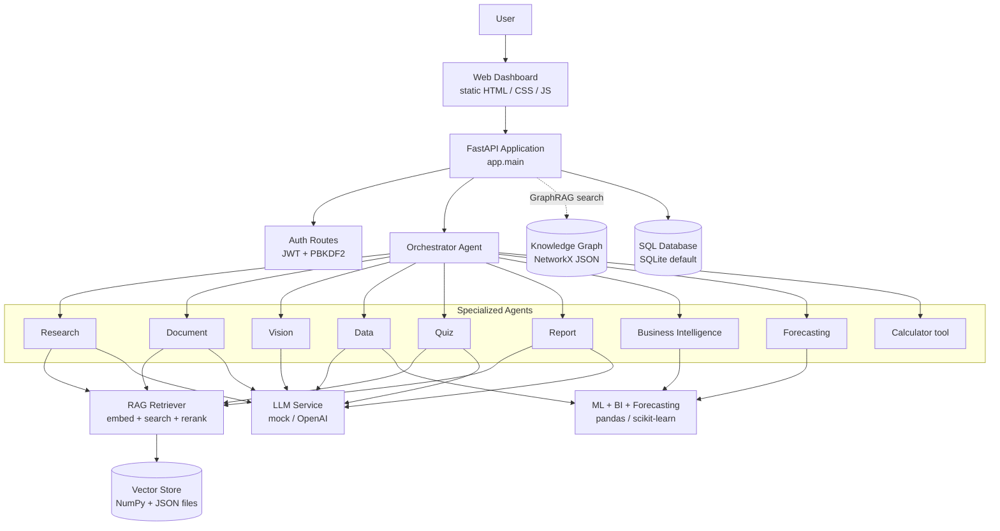
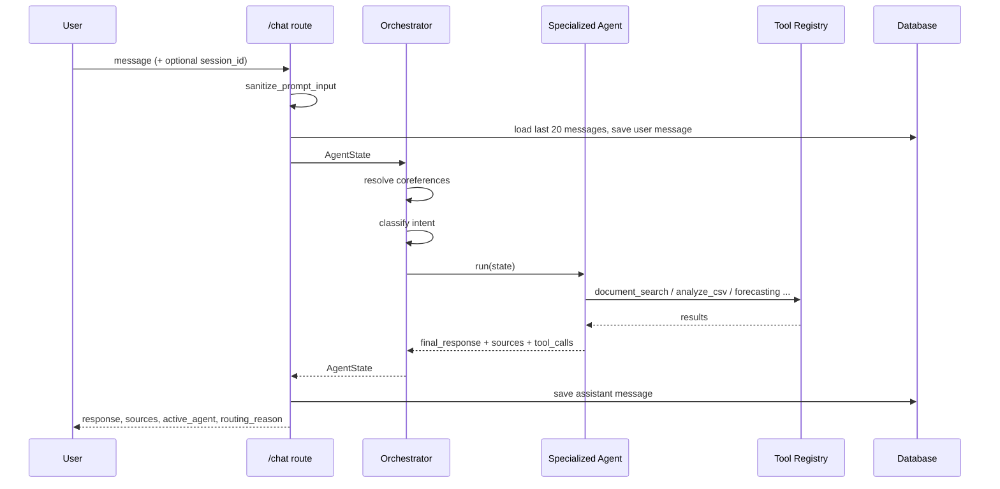
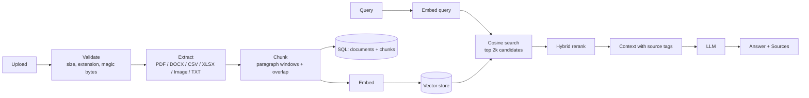
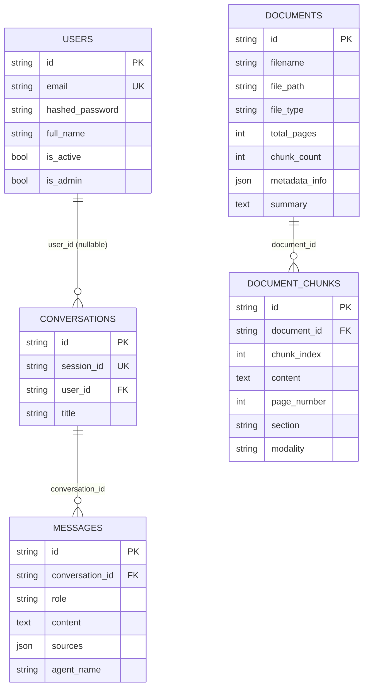

<div align="center">

# 🧠 MultiMind AI

### Multi-Agent Orchestration • Multimodal RAG • Business Intelligence • ML • Forecasting

<p>
  <strong>A FastAPI platform that routes natural-language requests to specialized agents for document Q&amp;A with citations, tabular analytics, KPI reporting, machine learning and time-series forecasting, with a built-in web dashboard.</strong>
</p>

<p>
  
</p>


<p>
  
</p>

</div>

---

## Table of Contents

- [Overview](#overview)
- [Key Features](#key-features)
- [Architecture](#architecture)
- [Multi-Agent Workflow](#multi-agent-workflow)
- [Document Intelligence and RAG](#document-intelligence-and-rag)
- [GraphRAG Readiness](#graphrag-readiness)
- [Business Intelligence, ML and Forecasting](#business-intelligence-ml-and-forecasting)
- [LLM and Embedding Providers](#llm-and-embedding-providers)
- [Web Dashboard](#web-dashboard)
- [Technology Stack](#technology-stack)
- [Project Structure](#project-structure)
- [Database Architecture](#database-architecture)
- [Authentication and Security](#authentication-and-security)
- [Environment Variables](#environment-variables)
- [Installation](#installation)
- [Running the Application](#running-the-application)
- [API Documentation](#api-documentation)
- [Testing](#testing)
- [CI/CD](#cicd)
- [Docker](#docker)
- [Screenshots](#screenshots)
- [Troubleshooting](#troubleshooting)
- [Current Limitations](#current-limitations)
- [Roadmap](#roadmap)
- [Contributing](#contributing)
- [Security Reporting](#security-reporting)
- [License](#license)
- [Project Status](#project-status)
- [Author](#author)

---

## Overview

MultiMind AI is a Python/FastAPI backend with a bundled single-page dashboard. Users upload documents (PDF, DOCX, TXT, CSV, Excel, images), then interact through a chat endpoint. An **orchestrator agent** classifies each request and delegates it to one of eight specialized agents (research, document, vision, data, quiz, report, business intelligence, forecasting), or to a safe arithmetic calculator.

**What it solves:** one entry point for question answering over private documents (with source citations), quick analysis of tabular data, KPI computation, classical ML on uploaded datasets, and short-horizon forecasting, without wiring each tool together by hand.

**Who it is for:** developers and teams who want a readable, modular reference implementation of a multi-agent + RAG + analytics system that runs fully offline by default.

**Maturity:** the project is in **active development**. All pieces run end-to-end and pass the test suite, but several parts are intentionally lightweight (see [Current Limitations](#current-limitations)). In particular, the default configuration uses a **local mock LLM and a hashed-vector embedding**, so no API key is required to try it, and some mock responses are templated. Real LLM output requires configuring the OpenAI provider.

---

## Key Features

| Capability | Status | Description |
|---|---|---|
| Multi-agent orchestration | ✅ Implemented | Keyword-based intent routing to 8 agents plus a calculator, with conversation-history coreference resolution and a recorded tool-call trace |
| Multimodal ingestion | ✅ Implemented | PDF, DOCX, TXT, CSV, XLSX/XLS and PNG/JPG/JPEG/WEBP extraction, validation and chunking |
| RAG with citations | ✅ Implemented | Embed, cosine search, hybrid rerank, context assembly with `[Source n: file \| Page \| Section]` blocks |
| Grounded-answer prompt | ✅ Implemented | System prompt requires a fixed fallback sentence when context is insufficient |
| GraphRAG | 🟡 Partial | Graph store, entity/relationship extractors and hybrid retriever exist; the graph is **not populated during ingestion** |
| Business intelligence | ✅ Implemented | Revenue, cost, gross profit, margin, AOV, period growth, dimension ranking, rule-based insights |
| Machine learning | ✅ Implemented | Classification, regression, K-Means clustering and Isolation Forest anomaly detection on CSV/Excel |
| Forecasting | ✅ Implemented | Lag/calendar-feature Ridge or Random Forest forecaster with MAE/RMSE/MAPE validation |
| Report generation | 🟡 Partial | LLM-generated markdown report saved to the DB; a PDF export helper exists but is not exposed by any route |
| Quiz generation | 🟡 Partial | Works end-to-end; with the default mock LLM the questions are a fixed template |
| Vision / image analysis | 🟡 Partial | Image metadata extraction works; with the mock LLM the analysis text is templated, OCR needs optional `pytesseract` |
| Web dashboard | ✅ Implemented | Vanilla HTML/CSS/JS served at `/` |
| Authentication | 🟡 Partial | Register/login/JWT/profile exist, but almost all other endpoints are unauthenticated (see [Security](#authentication-and-security)) |
| Docker | ✅ Implemented | Dockerfile, compose file, health check |
| Background jobs / queues | 🚧 Not present | No Celery, Redis or task workers |

---

## Architecture



Routes are mounted both at the root and under `/api`, and the dashboard calls the root paths.

---

## Multi-Agent Workflow

The orchestrator (`app/agents/orchestrator.py`) runs these steps for every `/chat` request:

1. Resolve pronouns such as "it", "its", "this" using the previous user turn.
2. If the message is a plain arithmetic expression, evaluate it with the AST-based calculator and return.
3. Classify intent with ordered keyword rules and select an agent.
4. Run the agent, record tool calls and sources, and return the response.



### Agents

| Agent | Triggered by (keywords) | Behaviour | Dependencies |
|---|---|---|---|
| `quiz_agent` | quiz, mcq, multiple choice | Retrieves context, generates up to 20 MCQs via the LLM | RAG, LLM |
| `vision_agent` | diagram, image, screenshot, visual, picture, photo | Analyzes the most recent PNG/JPG in the upload directory, else a text-only fallback | ImageProcessor, LLM |
| `forecasting_agent` | forecast, predict next, future sales, time series | Heuristically picks date and numeric columns, forecasts 7 periods | Forecasting module |
| `bi_agent` | kpi, profit margin, gross profit, sales growth, aov | Computes KPIs and insights from the latest CSV/XLSX | Business intelligence module |
| `data_agent` | excel, csv, dataset, statistics, missing values | Profiles the latest CSV/XLSX and asks the LLM to answer from the profile | CSV/Excel processors, LLM |
| `report_agent` | generate report, create report, intelligence report | Retrieves up to 6 chunks and generates a structured report | RAG, LLM |
| `document_agent` | summarize, summary of, compare these | Summarization or comparison over retrieved context | RAG, LLM |
| `research_agent` | default | Retrieves top-4 chunks and answers with the grounded RAG prompt | RAG, LLM |

Routing is deterministic keyword matching, not LLM-based. The `ROUTER_PROMPT` constant in `app/rag/prompts.py` is not used by the orchestrator.

---

## Document Intelligence and RAG



| Stage | Implementation |
|---|---|
| Extraction | `pypdf` (PDF, per-page text and headings), `python-docx` (paragraphs, tables), `pandas`/`openpyxl` (CSV, Excel), Pillow (images, with optional OCR if `pytesseract` is installed), plain read for TXT |
| Chunking | `IntelligentChunker`: splits on paragraph boundaries into `CHUNK_SIZE` windows with `CHUNK_OVERLAP`, tracks page and heading-like section |
| Embeddings | `mock` provider: deterministic 384-d hashed token and bigram projection (offline); `openai` provider via REST when an API key is set |
| Vector store | Custom in-process store: normalized NumPy matrix, brute-force cosine similarity, metadata filtering, persisted to `index.json` and `vectors.npy` |
| Reranking | Heuristic: 70% vector score + 20% lexical overlap + 0.2 exact-phrase bonus |
| Grounding | System prompt demands exact fallback text *"I could not find this information in the uploaded documents."* and a `Sources:` section |

Supported upload types: `.pdf .docx .txt .csv .xlsx .xls .png .jpg .jpeg .webp` (configurable via `ALLOWED_EXTENSIONS`).

> The default embedding is a lexical hashing scheme, not a neural semantic model. Retrieval quality on paraphrased queries will be limited until a real embedding provider is used.

---

## GraphRAG Readiness

**Status: 🟡 Partially implemented.**

Implemented:

- `EntityExtractor`: a built-in vocabulary of technology, concept and metric terms plus Title-Case and acronym patterns.
- `RelationshipExtractor`: sentence-level relation detection.
- `KnowledgeGraphStore`: a NetworkX `DiGraph` persisted to `<VECTOR_DB_PATH>/knowledge_graph.json`, with sub-graph queries.
- `GraphRAGRetriever.retrieve_hybrid`: combines vector chunks with graph facts. It is used by `POST /search` (default `use_graph: true`) and its summary appears in `/health`.

Not implemented: **the ingestion pipeline never calls the graph store**, so the graph stays empty unless populated programmatically. Until that wiring is added, `/search` returns vector results and empty `graph_facts`. See [`docs/GRAPHRAG.md`](docs/GRAPHRAG.md).

---

## Business Intelligence, ML and Forecasting

### Business intelligence (`app/business_intelligence`)

- **KPIs:** total revenue, cost, gross profit, profit margin %, average order value, total orders, month-over-month growth. Columns are auto-detected by name (`revenue`/`sales`/`amount`/`price`, `cost`/`expenses`/`cogs`, `date`...) or passed explicitly.
- **Dimension analysis:** top-N grouping with share of total.
- **Insights:** rule-based text (margin bands, growth direction, concentration risk above 40% share).
- Endpoint: `POST /analytics`. Results are stored in `analysis_results`.

### Machine learning (`app/ml`) — `POST /analyze-data`

| Task | Algorithm(s) | Metrics |
|---|---|---|
| `classification` | Random Forest (default), Logistic Regression | accuracy, precision, recall, F1 |
| `regression` | Random Forest (default), Ridge | MAE, MSE/RMSE, R² |
| `clustering` | K-Means (`n_clusters`) | silhouette-based evaluation |
| `anomaly_detection` | Isolation Forest (contamination 0.05) | anomaly counts |

Pipeline: median/mode imputation → one-hot encoding → `StandardScaler` → 80/20 split → train → evaluate, plus Pearson correlations (|r| ≥ 0.7). Models are trained per request and are **not persisted**. This is the only anomaly-detection and segmentation capability; there is no dedicated customer-segmentation module, though K-Means clustering can be run on any numeric dataset.

### Forecasting (`app/forecasting`) — `POST /forecast`

Aggregates duplicates by date, builds calendar (trend index, month, weekday, day) and lag/rolling-mean features, trains Ridge (default) or Random Forest on an ~80/20 chronological split, reports MAE/RMSE/MAPE, refits on all data and forecasts recursively. Requires at least 5 data points. Forecasts are floored at zero.

Details: [`docs/BUSINESS_INTELLIGENCE.md`](docs/BUSINESS_INTELLIGENCE.md), [`docs/MACHINE_LEARNING.md`](docs/MACHINE_LEARNING.md), [`docs/FORECASTING.md`](docs/FORECASTING.md).

---

## LLM and Embedding Providers

| Setting | Working values | Notes |
|---|---|---|
| `LLM_PROVIDER` | `mock` (default), `openai` | `openai` calls `chat/completions` over HTTP and **falls back to the mock engine on any error** |
| `EMBEDDING_PROVIDER` | `mock` (default), `openai` | Falls back to hashed vectors on error |

`.env.example` and code comments also mention Groq, Gemini, Anthropic and sentence-transformers, but **no code path implements them**; selecting them silently uses the mock engine.

The **mock LLM** is a local deterministic engine, not a language model. RAG answers are extractive (top matching sentences with citations); summaries, quizzes and image analyses are fixed templates. The OpenAI model name comes from `LLM_MODEL`.

---

## Web Dashboard

A dependency-free single-page app in `static/` (served at `/`, assets at `/static`). It uses the REST API through `fetch` and loads Google Fonts and the Lucide icon script from external CDNs.

Tabs: Dashboard, Chat, Documents, Knowledge, Agents, Data, Vision, Forecast, Reports, Activity, Settings. On load it signs in automatically through `/auth/switch-user` (see [Security](#authentication-and-security)).

---

## Technology Stack

| Layer | Technology | Purpose |
|---|---|---|
| Language | Python 3.11 / 3.12 | Application code (CI-tested versions; Docker uses 3.11) |
| API | FastAPI, Uvicorn, Pydantic v2, pydantic-settings, python-multipart | HTTP API, validation, uploads, OpenAPI docs |
| Database | SQLAlchemy 2.x, SQLite (default) | Persistence; `DATABASE_URL` accepts other SQLAlchemy URLs (driver not included) |
| Auth | PyJWT, `cryptography`, stdlib `hashlib` | JWT tokens, PBKDF2 password hashing |
| Data / ML | pandas, NumPy, SciPy, scikit-learn | Analytics, ML, forecasting, vector math |
| Documents | pypdf, python-docx, openpyxl, Pillow, reportlab | Extraction and PDF export helper |
| Graph | NetworkX | Knowledge-graph store |
| HTTP client | httpx | OpenAI REST calls |
| Frontend | HTML, CSS, vanilla JavaScript | Dashboard (no build step) |
| Testing | pytest, pytest-asyncio | Test suite |
| DevOps | Docker, Docker Compose, GitHub Actions | Containerization and CI |

---

## Project Structure

```text
MULTIMIND AI/
├── app/
│   ├── main.py                  # FastAPI app, CORS, static mount, error handler
│   ├── api/                     # Routers: health, auth, documents, chat, agents, analysis
│   ├── agents/                  # Orchestrator, 8 specialized agents, tool registry, state
│   ├── rag/                     # Chunking, embeddings, vector store, retriever, reranker, ingestion, prompts
│   ├── graph/                   # Entities, relationships, graph store, GraphRAG retriever
│   ├── multimodal/              # PDF, DOCX, CSV, Excel, image processors
│   ├── business_intelligence/   # KPIs, dimension analytics, insights
│   ├── ml/                      # Preprocessing, training, evaluation, inference, features
│   ├── forecasting/             # Time-series preprocessing, model, training, inference
│   ├── services/                # LLM, document and report services
│   ├── database/                # SQLAlchemy models, repositories, connection
│   ├── config/                  # Settings (environment-driven)
│   └── utils/                   # Security, file validation, logging
├── static/                      # Dashboard (index.html, app.js, style.css)
├── tests/                       # 8 test files + conftest.py (34 tests)
├── docs/                        # 14 topic documents
├── data/                        # Runtime storage: uploads, processed, vector_store, SQLite, logs
├── .github/workflows/ci.yml
├── Dockerfile
├── docker-compose.yml
├── requirements.txt
└── .env.example
```

---

## Database Architecture

Nine tables are created automatically at startup with `Base.metadata.create_all` (there is no migration tool).



Standalone tables: `reports` (generated reports), `analysis_results` (ML/BI runs), `forecast_results` (forecast metrics and points), `agent_sessions` (model defined; not currently written by any route). Conversations created through `/chat` do not set `user_id`.

See [`docs/DATABASE.md`](docs/DATABASE.md).

---

## Authentication and Security

### Implemented

| Mechanism | Detail |
|---|---|
| Password hashing | PBKDF2-HMAC-SHA256, 100,000 iterations, 16-byte random salt, constant-time comparison |
| Tokens | HS256 JWT with `sub`, `email`, `iat`, `exp`; default lifetime 1440 min (`ACCESS_TOKEN_EXPIRE_MINUTES`) |
| Upload validation | Size limit (`MAX_UPLOAD_SIZE_MB`), extension allow-list, magic-byte check for PDF/PNG/JPG/DOCX/XLSX/WEBP, UTF-8/Latin-1 check for text, filename sanitization |
| Prompt-injection filter | Regex screen of `/chat` input for common override phrases |
| Log secret masking | Logging filter redacts key/token/password patterns and JWTs |
| Safe calculator | AST-based arithmetic evaluator, no `eval` |
| Input validation | Pydantic models, `EmailStr`, profile name length limits |

### Known security gaps

These are documented intentionally; treat the current build as a **local or demo deployment**, not an internet-facing one.

- Only `GET /auth/me`, `GET/PUT /auth/profile` (and their `/user/*` aliases) require a token. **All other endpoints, including upload, delete, chat and analysis, are unauthenticated.**
- `POST /auth/switch-user` issues a token for any email **without a password** and creates the user with a fixed default password if missing. `GET /auth/users` lists users publicly. The dashboard relies on this for its demo user switcher.
- Three demo users are seeded on an empty database with a shared default password (see `app/database/connection.py`).
- `SECRET_KEY` has an insecure built-in default; always override it.
- CORS allows all origins with credentials.
- `/forecast`, `/analyze-data`, `/analytics` and `/analyze-image` accept a **server-side file path** from the request body without restricting it to the upload directory.
- Unhandled exceptions return the exception text in the response body.
- No rate limiting, no role enforcement (the `is_admin` flag is stored but not checked), no token revocation.

Never commit `.env` files or secrets.

See [`docs/SECURITY.md`](docs/SECURITY.md).

---

## Environment Variables

Copy `.env.example` to `.env` (loaded by a built-in lightweight loader; real environment variables take precedence).

| Variable | Required | Default | Purpose |
|---|---|---|---|
| `APP_NAME` | No | `MultiMind AI` | Application title |
| `APP_ENV` | No | `development` | Environment label |
| `APP_HOST` / `APP_PORT` | No | `0.0.0.0` / `8000` | Used by `python -m app.main` |
| `DEBUG` | No | `True` | Enables auto-reload for `python -m app.main` |
| `SECRET_KEY` | **Yes (production)** | insecure placeholder | JWT signing key |
| `ALGORITHM` | No | `HS256` | JWT algorithm |
| `ACCESS_TOKEN_EXPIRE_MINUTES` | No | `1440` | Token lifetime |
| `DATABASE_URL` | No | SQLite file in `data/` | SQLAlchemy database URL |
| `LLM_PROVIDER` | No | `mock` | `mock` or `openai` |
| `LLM_API_KEY` | For `openai` | empty | API key for LLM and embeddings |
| `LLM_MODEL` | No | `gpt-4o-mini` | Chat model name |
| `LLM_TEMPERATURE` / `LLM_MAX_TOKENS` | No | `0.2` / `2048` | Generation settings |
| `EMBEDDING_PROVIDER` | No | `mock` | `mock` or `openai` |
| `EMBEDDING_MODEL` | No | `text-embedding-3-small` | OpenAI embedding model |
| `EMBEDDING_DIM` | No | `384` | Mock vector dimension (read by code; not in `.env.example`) |
| `VECTOR_DB_TYPE` | No | `memory_chroma` | **Informational only**; the built-in NumPy store is always used |
| `VECTOR_DB_PATH` | No | `data/vector_store` | Vector index and graph JSON location |
| `CHUNK_SIZE` / `CHUNK_OVERLAP` | No | `600` / `100` | Chunking |
| `TOP_K` / `SIMILARITY_THRESHOLD` | No | `4` / `0.35` | Retrieval |
| `MAX_UPLOAD_SIZE_MB` | No | `50` | Upload limit |
| `ALLOWED_EXTENSIONS` | No | list of 10 types | Upload allow-list |
| `LOG_LEVEL` | No | `INFO` | Log verbosity |

`.env.example` also lists `UPLOAD_DIR`, `PROCESSED_DIR` and `LOG_FILE`, but `settings.py` currently hard-codes these under `data/` and does not read them.

```env
SECRET_KEY=your_secret_key
DATABASE_URL=sqlite:///./data/multimind.db
LLM_PROVIDER=mock
LLM_API_KEY=your_api_key_if_using_openai
```

---

## Installation

**Prerequisites:** Python 3.11 or 3.12, `pip`, Git. Docker is optional.

```bash
git clone <your-repository-url>
cd "MULTIMIND AI"
```

Create a virtual environment.

Windows (PowerShell):

```powershell
python -m venv .venv
.venv\Scripts\activate
```

Linux / macOS:

```bash
python3 -m venv .venv
source .venv/bin/activate
```

Install dependencies:

```bash
pip install -r requirements.txt
pip install email-validator   # required by pydantic EmailStr; see note below
```

> **Known issue:** `email-validator` is imported indirectly (`pydantic.EmailStr` in `app/api/routes_auth.py`) but is **not listed in `requirements.txt`**. A clean install fails at import time without it. Adding `email-validator` (or `pydantic[email]`) to `requirements.txt` fixes this, and also fixes the CI and Docker builds.

Configure the environment:

```bash
cp .env.example .env      # Windows: copy .env.example .env
# then edit SECRET_KEY (and LLM_API_KEY if using the OpenAI provider)
```

**Database:** no manual step. Tables are created and demo users are seeded automatically on first startup (SQLite file at `data/multimind.db`).

---

## Running the Application

```bash
uvicorn app.main:app --reload
```

or

```bash
python -m app.main
```

| URL | Content |
|---|---|
| `http://localhost:8000/` | Web dashboard |
| `http://localhost:8000/docs` | Swagger UI |
| `http://localhost:8000/redoc` | ReDoc |
| `http://localhost:8000/health` | Health check |

The frontend is static and served by the same process; there is no separate frontend command.

---

## API Documentation

Every route below is available both at the root and under the `/api` prefix. Interactive documentation is generated at `/docs`. Full notes in [`docs/API.md`](docs/API.md).

| Method | Endpoint | Purpose | Auth |
|---|---|---|---|
| GET | `/health` | Database, vector store and graph status | None |
| GET | `/settings/config` | Active non-secret configuration | None |
| POST | `/auth/register` | Create account, returns token | None |
| POST | `/auth/login` | Email and password login, returns token | None |
| POST | `/auth/switch-user` | Demo switcher; token without password | None |
| GET | `/auth/users` | List active users | None |
| GET | `/auth/me` | Current user | Bearer |
| GET / PUT | `/auth/profile` | Read / update full name | Bearer |
| POST | `/upload` | Upload and ingest a file | None |
| GET | `/documents` | List documents (`limit`, `offset`) | None |
| GET | `/documents/{id}` | Document details | None |
| DELETE | `/documents/{id}` | Delete file, DB rows and vectors | None |
| POST | `/summarize` | Summarize a document id or raw text | None |
| POST | `/chat` | Orchestrated chat | None |
| GET | `/conversation/{session_id}` | Message history | None |
| POST | `/search` | Vector search with optional GraphRAG | None |
| POST | `/generate-quiz` | Generate MCQs | None |
| POST | `/generate-report` | Generate and store a report | None |
| POST | `/analyze-image` | Analyze an image by server path | None |
| POST | `/analyze-data` | ML pipeline on CSV/Excel | None |
| POST | `/analytics` | BI KPIs and insights | None |
| POST | `/forecast` | Time-series forecast | None |

The auth router is also mounted under `/user` (for example `/api/user/profile`, used by the dashboard).

**Response format:** there is no global response envelope. Each endpoint returns its own JSON shape; FastAPI errors return `{"detail": ...}`, and unhandled exceptions return `{"error": "Internal Server Error", "detail": "..."}`.

Example:

```bash
curl -X POST http://localhost:8000/chat \
  -H "Content-Type: application/json" \
  -d '{"message": "What is supervised learning?"}'
```

Returns `session_id`, `response`, `sources`, `active_agent`, `routing_reason` and `tool_calls`.

---

## Testing

```bash
pytest
```

The suite contains **34 tests in 8 test files** (plus `conftest.py` fixtures) and uses a temporary SQLite database and vector store per run. At the time of writing all 34 pass on Python 3.12 (after installing `email-validator`).

| File | Covers |
|---|---|
| `test_agents.py` | Safe calculator, routing, coreference |
| `test_document_processors.py` | PDF, DOCX, CSV, Excel, image processors |
| `test_embeddings_vectorstore.py` | Chunking, embeddings, vector store CRUD |
| `test_rag.py` | Retrieval, reranking, grounded answers, missing-context fallback |
| `test_graphrag_api.py` | Graph store, health, auth + chat, upload API |
| `test_ml_bi_forecasting.py` | Classification, clustering, anomaly detection, forecasting, KPIs |
| `test_security.py` | Filename sanitization, upload validation, hashing, JWT, prompt filter |
| `test_user_profile.py` | Profile API |

No coverage measurement is configured, and there are no end-to-end browser tests.

---

## CI/CD

`.github/workflows/ci.yml` ("MultiMind AI CI/CD Pipeline"):

- **Triggers:** push to `main`, `master`, `develop`; pull requests to `main`, `master`.
- **`test` job:** Ubuntu, Python 3.11 and 3.12 matrix, pip cache, `pip install -r requirements.txt`, `pytest -v --durations=10`.
- **`docker-build` job:** builds the image with Buildx (no push) after tests pass.

There is no linting step and no deployment step. Because `email-validator` is missing from `requirements.txt`, the test job will fail until that dependency is added. A live workflow-status badge can be added once the final repository URL is known.

---

## Docker

```bash
docker compose up --build
```

or

```bash
docker build -t multimind-ai .
docker run -p 8000:8000 -v "$(pwd)/data:/app/data" multimind-ai
```

The image uses `python:3.11-slim`, installs `requirements.txt`, copies `app/`, `static/` and `docs/`, exposes port 8000 and defines a `curl`-based health check on `/health`. Compose runs one service with the mock LLM/embeddings and mounts `./data` for persistence. No external database or cache service is included.

---

## Screenshots

Screenshots will be added as the UI documentation is expanded.

---

## Troubleshooting

| Symptom | Cause and fix |
|---|---|
| `ImportError: email-validator is not installed` | Run `pip install email-validator` (missing from `requirements.txt`) |
| Chat answers look generic or templated | The default `LLM_PROVIDER=mock` is a local engine; configure `openai` with `LLM_API_KEY` for model-generated text |
| Retrieval misses paraphrased questions | Default embeddings are lexical hashes; use `EMBEDDING_PROVIDER=openai` |
| Changing `UPLOAD_DIR` / `LOG_FILE` has no effect | These are hard-coded in `settings.py` |
| `PostgreSQL` URL fails to connect | No PostgreSQL driver is included in `requirements.txt`; install one (for example `psycopg`) |
| Selecting `groq`, `gemini` or `anthropic` has no effect | Those providers are not implemented; the mock engine is used |
| Image OCR text is empty | Install the optional `pytesseract` package and the Tesseract binary |
| Port already in use | Change `APP_PORT` or pass `--port` to Uvicorn |

---

## Current Limitations

- Only OpenAI is implemented as an external LLM and embedding provider.
- The mock LLM returns templated quizzes, summaries and image analyses.
- GraphRAG is not connected to ingestion, so the graph is empty by default.
- Agent routing is keyword-based; the data, BI and forecasting agents use the most recently globbed CSV/XLSX in the upload directory unless a path is supplied.
- The vector store is a flat in-memory NumPy index persisted as JSON/`.npy`; it loads fully into memory and has no approximate search.
- Most endpoints are unauthenticated (see [security gaps](#known-security-gaps)).
- No background workers, rate limiting or database migrations.
- PDF report export exists in `ReportService.export_pdf` but is not exposed through the API.
- No formal benchmark data is currently included in the repository.
- No test coverage measurement.

---

## Roadmap

**Current**

- [x] Multi-agent orchestration with 8 agents and a safe calculator
- [x] Multimodal ingestion and RAG with citations
- [x] BI KPIs, ML pipelines and forecasting
- [x] Web dashboard, Docker image, CI workflow

**Next (partially implemented)**

- [ ] Populate the knowledge graph during ingestion
- [ ] Expose PDF report export through an endpoint
- [ ] Enforce authentication and authorization on data endpoints; remove password-less `switch-user`
- [ ] Add `email-validator` to `requirements.txt`

**Future**

- [ ] Additional LLM and embedding providers (Groq, Gemini, Anthropic, sentence-transformers)
- [ ] Persistent vector database backend
- [ ] Rate limiting and restricted file-path handling
- [ ] Database migrations and PostgreSQL support
- [ ] Linting and coverage reporting in CI

---

## Contributing

1. Fork the repository.
2. Create a branch: `git checkout -b feature/my-feature`
3. Make your changes.
4. Run the tests: `pytest`
5. Commit: `git commit -m "Describe your change"`
6. Push: `git push origin feature/my-feature`
7. Open a Pull Request.

No contribution guidelines file exists yet; please keep changes consistent with the existing module layout.

---

## Security Reporting

No security policy file is currently included. Please **do not open a public issue** for vulnerabilities. Contact the maintainer privately (for example via a private GitHub security advisory on the repository, once enabled) with reproduction steps.

---

## License

No explicit open-source license is currently included in this repository.

---

## Project Status

> **Project Status:** Active Development. The core platform runs end-to-end and its test suite passes, but authentication hardening, GraphRAG wiring and non-OpenAI providers are still open.

---

## Author

<p align="center">
  Designed &amp; Developed by <strong>Youza Ahsan</strong>
</p>

<p align="center">
  ⭐ If you find this project useful, consider starring the repository.
</p>
