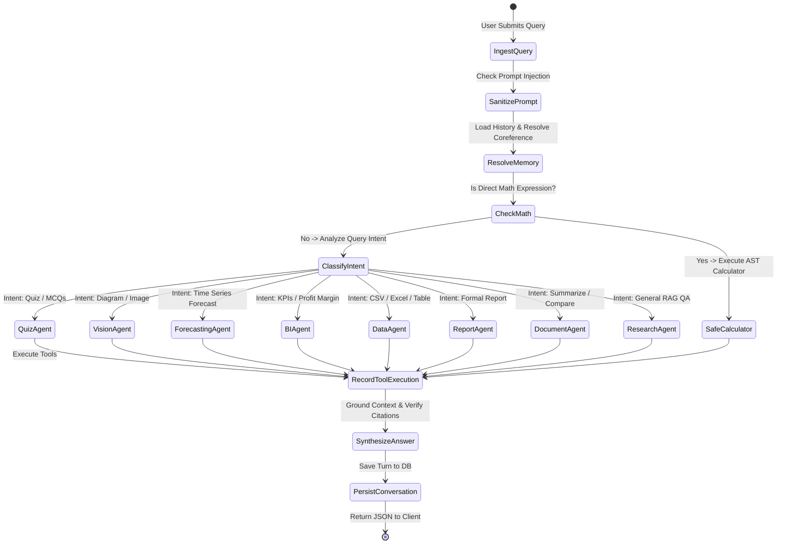

# MultiMind AI — Agent Workflow & Orchestration State Machine

This document details the internal lifecycle of the Orchestrator, conversational state transitions, coreference resolution, and tool execution traces.

---

## 1. Agent State Model (`app/agents/state.py`)

The orchestration lifecycle operates on an immutable, traceable `AgentState` object:

```python
class AgentState(BaseModel):
    session_id: str
    user_query: str
    resolved_query: Optional[str] = None
    chat_history: List[AgentMessage]
    active_agent: Optional[str] = None
    routing_reason: Optional[str] = None
    tool_calls: List[ToolCallRecord]
    retrieved_context: Optional[str] = None
    sources: List[Dict[str, Any]]
    final_response: Optional[str] = None
    error: Optional[str] = None
```

---

## 2. Orchestration State Machine



---

## 3. Conversational Memory & Coreference Resolution

A critical challenge in agentic RAG is multi-turn context continuity:

* **User Turn 1:** *"What is supervised learning?"*
* **Assistant Turn 1:** *"Supervised learning uses labeled training data..."*
* **User Turn 2:** *"What are its advantages?"*

Without memory resolution, Turn 2 fails because the pronoun *"its"* is ambiguous.

### Resolution Algorithm (`app/agents/orchestrator.py`):
1. Detects pronouns: `["its", "their", "it", "this", "these"]`.
2. Inspects preceding user messages in `chat_history`.
3. Strips query wrappers (*"what is"*, *"explain"*, etc.) to extract the anchor concept (`"supervised learning"`).
4. Substitutes the pronoun:
   `"What are its advantages?"` $\rightarrow$ `"What are supervised learning's advantages?"`.
5. Passes the fully disambiguated query to the vector retriever and agents.

---

## 4. Safe Tool Execution Trace

Every tool invocation logs an audit record in `state.tool_calls`:
```json
{
  "tool_name": "business_analysis",
  "arguments": {"file": "q3_sales.csv"},
  "output": {"kpis_calculated": ["total_revenue", "gross_profit", "profit_margin_percent"]},
  "status": "success"
}
```
This ensures complete observability into what tools were triggered, why they were chosen, and what data they processed.
