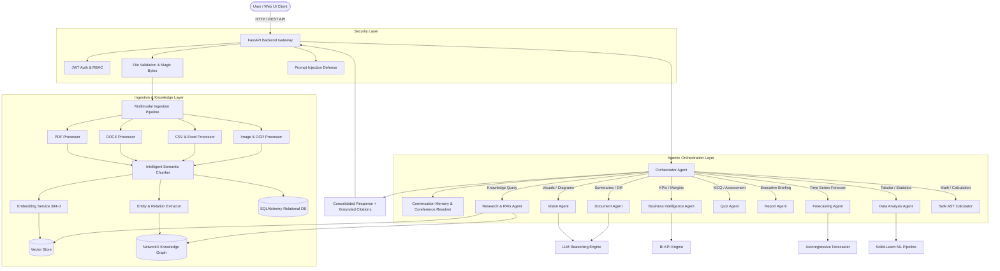

# MultiMind AI — System Architecture

## 1. High-Level Architecture Overview

MultiMind AI is an enterprise-grade Multimodal Retrieval-Augmented Generation (RAG) and Autonomous Multi-Agent Intelligence platform built natively in Python. The system ingests multi-format documents (PDF, DOCX, TXT, CSV, Excel, Images), indexes semantic embeddings and relational knowledge graphs, and resolves complex analytical queries via an Orchestrator Agent and specialized domain agents.

---

## 2. Core Architectural Components

### 2.1 API & Security Layer
* **FastAPI Application (`app/main.py`):** Asynchronous ASGI router providing Swagger/OpenAPI documentation (`/docs`), CORS handling, lifecycle management, and static dashboard asset serving.
* **Authentication & Sanitization (`app/utils/security.py`, `file_validation.py`):** Password hashing via PBKDF2-HMAC-SHA256, PyJWT bearer token verification, file magic byte validation against header spoofing, and regex-based prompt injection filtering.

### 2.2 Ingestion & Multimodal Processing Layer
* **Multimodal Processors (`app/multimodal/`):**
  * `PDFProcessor`: Page-aware text extraction, heading detection, and heuristic table boundary identification.
  * `DocxProcessor`: Paragraph hierarchy, styles, and markdown table conversion.
  * `CSVProcessor` & `ExcelProcessor`: Data profiles, numeric distributions (mean, std, min, max), missing value percentages, formula inspection, and multi-sheet parsing.
  * `ImageProcessor`: Metadata extraction (dimensions, luminance, contrast), OCR extraction, and base64 encoding.

### 2.3 Knowledge Retrieval Layer (Hybrid RAG + GraphRAG)
* **Intelligent Chunking (`app/rag/chunking.py`):** Splits text by paragraphs and section headings while maintaining configurable word windows, overlap, and chunk metadata (`document_id`, `filename`, `page_number`, `section`, `modality`).
* **Vector Store (`app/rag/vector_store.py`):** In-memory and persistent cosine similarity search engine with metadata filtering and batch operations.
* **Reranker (`app/rag/reranker.py`):** Hybrid reranking combining cosine similarity with lexical BM25-style term frequency and exact phrase bonuses.
* **Knowledge Graph (`app/graph/`):** NetworkX-backed directed knowledge graph representing extracted entities (`Concept`, `Technology`, `Metric`, `Model`) and typed relationships (`USES`, `IMPLEMENTS`, `OPTIMIZES`, `EVALUATES_ON`).

### 2.4 Agent Orchestration & Specialized Agents
* **Orchestrator Agent (`app/agents/orchestrator.py`):** Resolves coreferences across conversation turns (e.g. converting "What are its advantages?" to "What are supervised learning's advantages?"), classifies query intent, routes to specialized agents, and logs execution traces.
* **Specialized Domain Agents (`app/agents/`):**
  * `ResearchAgent`: RAG retrieval with verified citations.
  * `DocumentAgent`: Summarization and multi-document comparisons.
  * `VisionAgent`: Technical diagram and chart interpretation.
  * `DataAgent`: Tabular dataset statistics and column insights.
  * `QuizAgent`: Multiple Choice Question generation.
  * `ReportAgent`: Structured executive intelligence reports.
  * `BusinessIntelligenceAgent`: Financial KPIs, profit margins, and growth rates.
  * `ForecastingAgent`: Recursive time series forecasting.

---

## 3. Data Flow Pipelines

### 3.1 Document Ingestion Pipeline
1. Client uploads file (`POST /upload`).
2. `validate_uploaded_file` checks file size (default max 50MB), allowed extension, and magic byte headers.
3. Filename is sanitized to prevent directory traversal (`..`, `/`, `\`).
4. Type-specific processor extracts text, tables, images, and metadata.
5. `IntelligentChunker` partitions content into structured chunks with page numbers.
6. `EmbeddingService` generates 384-dimensional dense vectors.
7. Vectors and metadata are indexed in `VectorStore`.
8. Document record and chunks are persisted in relational database.

### 3.2 Conversational RAG Query Pipeline
1. Client submits query (`POST /chat`).
2. Query is sanitized against adversarial prompt injection.
3. Conversation history is loaded from database.
4. Orchestrator resolves pronouns against previous conversation turns.
5. Orchestrator selects agent (e.g. `research_agent`).
6. Retriever executes dense vector similarity search + hybrid reranker.
7. Grounded context is formatted with explicit source boundaries.
8. LLM synthesizes response with verified document and page citations.
9. Response and citations are stored in database and returned to user.
