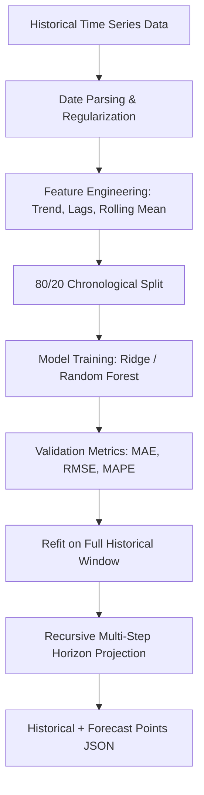

# MultiMind AI — Time Series Forecasting Architecture

The Forecasting Module enables predictive modeling for sales forecasting, demand planning, revenue projections, and inventory management.

---

## 1. Forecasting Architecture

---

## 2. Feature Engineering Pipeline (`app/forecasting/preprocessing.py`)

1. **Temporal Calendar Features:**
   * `trend_idx`: Linear integer trend counter ($0, 1, 2, \dots, N$).
   * `month`: Calendar month ($1-12$) capturing annual seasonality.
   * `day_of_week`: Day of week ($0-6$) capturing weekly seasonality.
   * `day_of_month`: Day index ($1-31$).
2. **Autoregressive Lag Variables:**
   * $\text{lag}_1, \text{lag}_2, \text{lag}_3$: Captures short-term autoregressive momentum.
3. **Rolling Window Statistics:**
   * `rolling_mean_3`: 3-period moving average smoothing transient noise.

---

## 3. Out-of-Sample Evaluation Metrics

Models are evaluated on an out-of-sample holdout test window before producing future projections:
* **MAE (Mean Absolute Error):**
  $$\text{MAE} = \frac{1}{n} \sum_{i=1}^n |y_i - \hat{y}_i|$$
* **RMSE (Root Mean Squared Error):**
  $$\text{RMSE} = \sqrt{\frac{1}{n} \sum_{i=1}^n (y_i - \hat{y}_i)^2}$$
* **MAPE (Mean Absolute Percentage Error):**
  $$\text{MAPE} = \frac{100\%}{n} \sum_{i=1}^n \left| \frac{y_i - \hat{y}_i}{y_i} \right|$$

---

## 4. Recursive Multi-Step Forecasting (`app/forecasting/inference.py`)

To project $H$ periods into the future, the model performs **recursive forecasting**:
1. Predicts step $t+1$.
2. Appends $\hat{y}_{t+1}$ into the lag window.
3. Recomputes rolling statistics.
4. Predicts step $t+2$ through step $t+H$.
5. Constrains predictions to non-negative quantities when modeling demand or sales.
