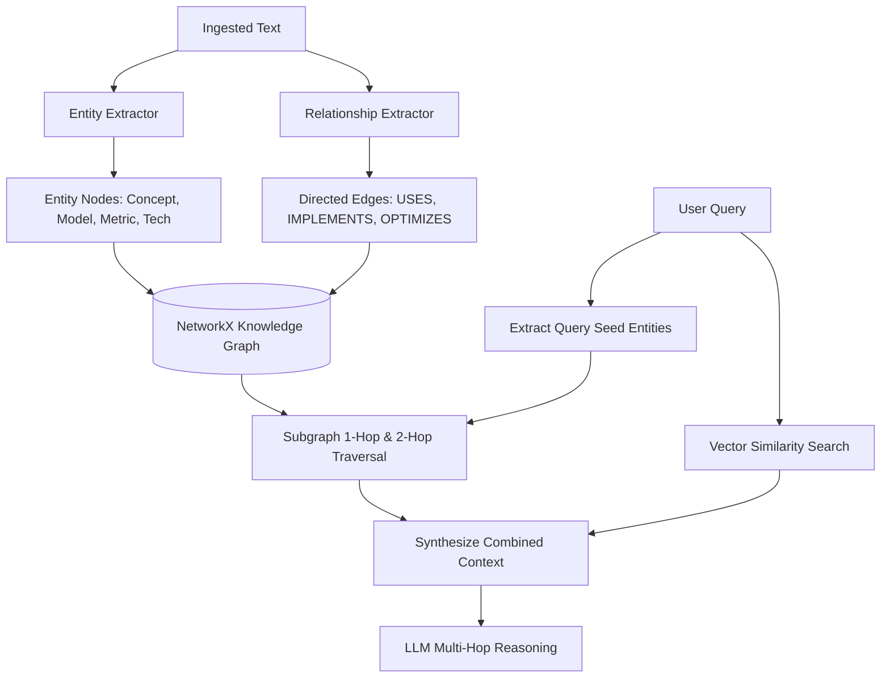

# MultiMind AI — GraphRAG & Knowledge Graph

Standard vector RAG excels at retrieving localized text chunks based on semantic similarity. However, it struggles with complex multi-hop queries spanning distant entities across multiple documents (e.g. *"Which models utilize the optimizer that improves transformer training?"*).

MultiMind AI addresses this limitation by integrating a **Knowledge Graph layer (GraphRAG)** that extracts entities, infers typed relational edges, and combines subgraph facts with dense vector retrieval.

---

## 1. GraphRAG Pipeline

---

## 2. Entity Extraction (`app/graph/entities.py`)

Identifies semantic entities and classifies them into structured categories:
* **`Concept`:** `Supervised Learning`, `Backpropagation`, `Gradient Descent`.
* **`Model`:** `Transformer`, `ResNet`, `Random Forest`, `Isolation Forest`.
* **`Metric`:** `Accuracy`, `Precision`, `F1-Score`, `MAE`, `RMSE`, `Profit Margin`.
* **`Technology`:** `FastAPI`, `Pydantic`, `LangGraph`, `Scikit-Learn`, `Docker`.

---

## 3. Relationship Extraction (`app/graph/relationships.py`)

Extracts typed directed edges between co-occurring entities in sentence clauses:
* `USES`: e.g. `[FastAPI] --USES--> [Pydantic]`
* `IMPLEMENTS`: e.g. `[LangGraph] --IMPLEMENTS--> [Agent Workflows]`
* `OPTIMIZES`: e.g. `[Gradient Descent] --OPTIMIZES--> [Loss Function]`
* `EVALUATES_ON`: e.g. `[Model] --EVALUATES_ON--> [Accuracy]`
* `DEPENDS_ON`: e.g. `[Supervised Learning] --DEPENDS_ON--> [Labeled Data]`

---

## 4. Knowledge Graph Store & Persistence (`app/graph/graph_store.py`)

* Backed by `networkx.DiGraph`.
* Persists to disk at `data/vector_store/knowledge_graph.json` using standard node-link graph schemas.
* Provides multi-hop neighbor search via `query_entity_subgraph(entity_name, max_depth=2)`.

---

## 5. Hybrid Retrieval Execution (`app/graph/graph_retriever.py`)

When the user queries the knowledge base (`POST /search` with `use_graph: true`), `GraphRAGRetriever` performs dual retrieval:
1. Dense Vector Search retrieves high-relevance text snippets.
2. Query Entity Extractor finds named entities in the question.
3. Graph Store traverses neighbor paths around those entities.
4. Combined context packages both relational triples and text paragraphs into the final prompt context.
