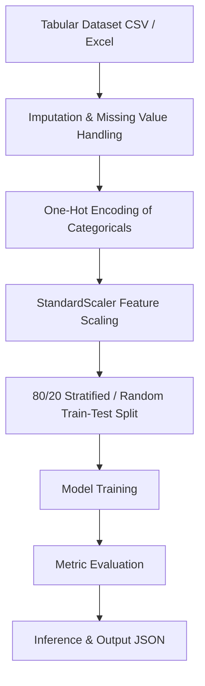

# MultiMind AI — Machine Learning Pipeline

MultiMind AI includes a modular scikit-learn machine learning engine capable of executing end-to-end classification, regression, clustering, and anomaly detection on user-provided datasets.

---

## 1. Machine Learning Architecture

---

## 2. Supported ML Tasks & Models

### 2.1 Supervised Classification
* **Algorithms:** `RandomForestClassifier(n_estimators=100)`, `LogisticRegression(max_iter=1000)`.
* **Evaluation Metrics:**
  * **Accuracy:** Percentage of correct predictions.
  * **Precision:** Ratio of true positives to total predicted positives.
  * **Recall:** Ratio of true positives to all actual positives.
  * **F1-Score:** Harmonic mean of precision and recall.

### 2.2 Supervised Regression
* **Algorithms:** `RandomForestRegressor(n_estimators=100)`, `Ridge(alpha=1.0)`.
* **Evaluation Metrics:**
  * **MAE (Mean Absolute Error):** Average magnitude of absolute errors.
  * **MSE (Mean Squared Error):** Average squared difference.
  * **RMSE (Root Mean Squared Error):** Square root of MSE in target units.
  * **$R^2$ Score (Coefficient of Determination):** Proportion of variance explained by model.

### 2.3 Unsupervised Clustering
* **Algorithm:** `KMeans(n_clusters=k, n_init=10)`.
* **Evaluation Metrics:**
  * **Silhouette Score:** Inter-cluster distance ratio $[-1, 1]$.
  * **Cluster Center Distribution:** Breakdown of records assigned per cluster.

### 2.4 Anomaly Detection
* **Algorithm:** `IsolationForest(contamination=0.05)`.
* **Evaluation Metrics:**
  * **Anomalies Detected:** Count and percentage of anomalous outliers.
  * **Inlier / Outlier Distribution:** Normal vs. abnormal record counts.

---

## 3. Real Execution & Verification

All evaluations in `app/ml/evaluation.py` compute true statistical figures directly from test predictions. No metrics are hard-coded or fabricated.
